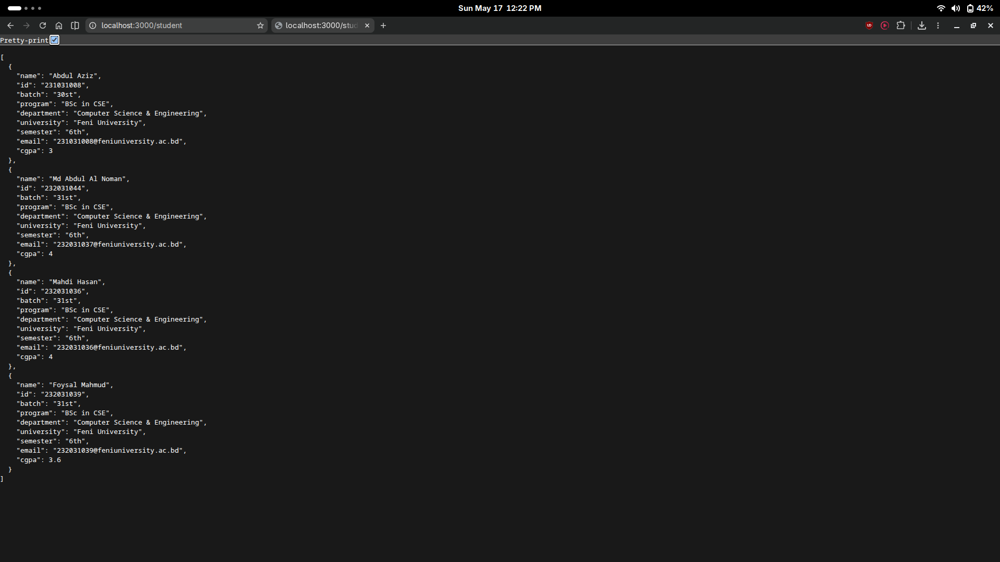

# Routing Task

This project is a simple Express.js setup that serves student data through a basic API route.

---

## API Endpoints

### GET `/student`

Retrieves student details from the server.

* **Endpoint:** `http://localhost:3000/student`
* **Request Type:** GET
* **Response Format:** JSON containing student information

---

## Sample Response

The image below shows the output returned when the `/student` route is accessed.

